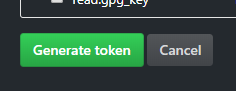
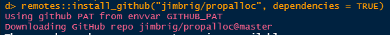

```{r, include = FALSE}
knitr::opts_chunk$set(
  collapse = TRUE,
  comment = "#>",
  eval = FALSE,
  warning = FALSE,
  error = FALSE,
  message = FALSE
)
```

## Setting up GitHub

In order to run the application locally, you will first need to install the 
`propalloc` R package and all of its dependencies on you machine first.

Because `propalloc` is a private Github repository, this means an additional 
step is necessary to access the repo for installation. This is done via the 
**Githun Personal Access Token (PAT)**.

### Creating and Storing your GitHub PAT

Get and store a PAT: 

1. Sign up for a free GitHub.com account and sign in if you do not already have 
   an account setup.
   
2. Call `usethis::browse_github_token()`. 

3. Verify the scopes and click "Generate token". 

4. Copy the token right away! 

5. Store the copied token in your `.Renviron` as the GITHUB_PAT environment 
   variable. `usethis::edit_r_environ()` opens this file for editing.

Step-by-step: 

First, install the `usethis` package via:

```{r install_usethis, eval=FALSE}
install.packages("usethis")
```

To setup the PAT run the code below which simply checks for a PAT already on your 
machine, and if you do not have one, it opens the web-browser for you to set one 
up.

```{r github_pat, eval=FALSE}
if (usethis::github_token() == "") {
  usethis::browse_github_pat()
}
```

On the webpage, first be sure to copy the token to your clipboard. 

Next, simply scroll down and select "Generate Token".



Now, move back into RStudio and run the code:

```{r setup, eval=TRUE}
usethis::edit_r_environ()
```

In the opened file, store the Github PAT as a system environment variable by 
assigning it the the key "GITHUB_PAT". Here's a screenshot of my `Renviron`:


Your's should look the same but with the copied token after 'GITHUB_PAT=', for 
example: 

```{r gh-path, eval=FALSE}
GITHUB_PATH=<paste from clipboard>
```

Then save the .Renviron file (Ctrl + S) and restart RStudio (Ctrl+Shift+F10).

## Install propalloc

Now that you have Github setup its time to install the R package.

You can install the production version of the app from the `master` branch, 
or a development version from the `develop` branch.

Code to install the package:

```{r}
# for master branch
remotes::install_github("jimbrig/propalloc", dependencies = TRUE)

# for develop branch
remotes::install_github("jimbrig/propalloc", ref = "develop", dependencies = TRUE)
```

If you get an error related to the `auth_token` then add this argument to the call: 

```{r}
remotes::install_github("jimbrig/propalloc", 
                        dependencies = TRUE, 
                        auth_token = "<your Github PAT>")
```


If this works you should see something similar to this after running the command: 



If prompted to update existing packages do so as you wish.

Lastly, you will need to install some additional packages by running 
`propalloc`'s custom function: 

```{r}
propalloc::install_app_dependencies()
```

Finally, restart R one more time and to run the app run:

```{r}
propalloc::run_app()
```


